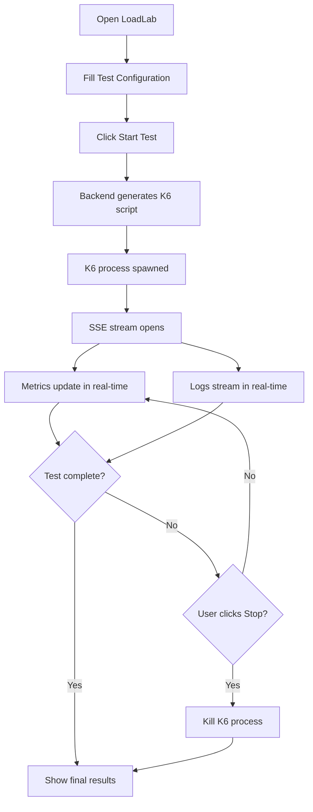

# PRD: LoadLab — K6 Load Testing Web Application

## 1. Overview

**LoadLab** adalah web application yang menyediakan antarmuka visual untuk menjalankan load test menggunakan **K6** langsung dari browser. User dapat memasukkan URL target, mengatur parameter test (VUs, duration, dll), memantau hasil secara real-time melalui counter statistik, dan melihat log output dari proses K6.

---

## 2. Problem Statement

Menjalankan K6 load test biasanya dilakukan melalui CLI, yang membutuhkan penulisan script dan pemahaman terminal. LoadLab menyederhanakan proses ini dengan menyediakan UI yang intuitif sehingga siapa pun bisa menjalankan load test tanpa perlu menulis script K6 secara manual.

---

## 3. Goals

- Mempermudah eksekusi K6 load test melalui UI berbasis web
- Menampilkan hasil test secara real-time (request success, error, dll)
- Menampilkan output log K6 secara live
- Desain modern, premium, dan responsif

---

## 4. Target Users

- Developer yang ingin melakukan load testing tanpa menulis script K6
- QA Engineer yang perlu quick load test
- DevOps yang ingin memantau performa endpoint

---

## 5. Features & Functional Requirements

### 5.1 Test Configuration Panel (Top Section)

Panel input untuk mengonfigurasi load test:

| Field | Type | Description | Default |
|-------|------|-------------|---------|
| **Target URL** | Text Input | URL endpoint yang akan di-test | — (required) |
| **HTTP Method** | Dropdown | GET, POST, PUT, PATCH, DELETE | GET |
| **Virtual Users (VUs)** | Number Input | Jumlah concurrent virtual users | 10 |
| **Duration** | Text Input | Durasi test (e.g. `30s`, `1m`, `5m`) | `30s` |
| **Ramp-up Stages** | Toggle + Dynamic Inputs | Opsi untuk menambahkan ramp-up stages (target VUs + duration per stage) | Off |
| **Request Headers** | Key-Value Inputs | Custom headers (e.g. Authorization, Content-Type) | — (optional) |
| **Request Body** | Textarea | Body payload untuk POST/PUT/PATCH | — (optional) |
| **Thresholds** | Key-Value Inputs | K6 thresholds (e.g. `http_req_duration: ['p(95)<500']`) | — (optional) |

**Actions:**
- **▶ Start Test** — Memulai load test
- **⏹ Stop Test** — Menghentikan test yang sedang berjalan

---

### 5.2 Statistics / Metrics Panel (Middle Section)

Real-time counter cards yang menampilkan metrik hasil test:

| Metric | Description | Visual |
|--------|-------------|--------|
| **Total Requests** | Jumlah total HTTP request yang dikirim | Counter card (biru) |
| **Success (2xx)** | Jumlah request yang berhasil (status 2xx) | Counter card (hijau) |
| **Client Errors (4xx)** | Jumlah request dengan status 4xx | Counter card (kuning) |
| **Server Errors (5xx)** | Jumlah request dengan status 5xx | Counter card (merah) |
| **Avg Response Time** | Rata-rata response time (ms) | Counter card |
| **P95 Response Time** | 95th percentile response time (ms) | Counter card |
| **Req/s** | Requests per second (throughput) | Counter card |
| **Failed Checks** | Jumlah checks yang gagal | Counter card (merah, jika ada) |

> [!NOTE]
> Semua metrik diupdate secara real-time selama test berjalan dan menampilkan nilai final setelah test selesai.

---

### 5.3 Live Logs Panel (Bottom Section)

- Menampilkan output stdout/stderr dari proses K6 secara real-time
- Auto-scroll ke bawah saat log baru masuk
- Tombol **Clear Logs** untuk membersihkan log
- Tombol **Copy Logs** untuk menyalin semua log ke clipboard
- Styling monospace font seperti terminal
- Warna berbeda untuk level log: info (putih), warning (kuning), error (merah)

---

## 6. Non-Functional Requirements

| Aspect | Requirement |
|--------|-------------|
| **Performance** | UI harus tetap responsif meskipun log output sangat banyak (virtualized list) |
| **Design** | Modern, dark mode, glassmorphism, micro-animations |
| **Responsiveness** | Desktop-first, tetapi responsif di tablet |
| **Real-time** | Menggunakan WebSocket atau SSE untuk streaming metrics & logs |
| **Security** | Validasi input URL, sanitize headers dan body |

---

## 7. Tech Stack

| Layer | Technology |
|-------|------------|
| **Frontend** | Next.js (React) + TypeScript |
| **Styling** | Shadcn UI (Tailwind CSS) |
| **Package Manager** | pnpm v9+ |
| **Backend** | Next.js API Routes |
| **Load Testing Engine** | K6 (dijalankan sebagai child process di server) |
| **Real-time Communication** | Server-Sent Events (SSE) |
| **Font** | Inter (Google Fonts) |

---

## 8. Architecture Overview

```
┌─────────────────────────────────────────┐
│              Browser (Client)            │
│                                          │
│  ┌──────────────────────────────────┐   │
│  │   Test Config Panel (inputs)      │   │
│  └──────────────────────────────────┘   │
│  ┌──────────────────────────────────┐   │
│  │   Statistics Cards (real-time)     │   │
│  └──────────────────────────────────┘   │
│  ┌──────────────────────────────────┐   │
│  │   Live Logs (terminal-style)      │   │
│  └──────────────────────────────────┘   │
└────────────────┬────────────────────────┘
                 │ SSE Stream
                 ▼
┌─────────────────────────────────────────┐
│           Next.js API Routes             │
│                                          │
│  POST /api/test/start                    │
│  POST /api/test/stop                     │
│  GET  /api/test/stream (SSE)             │
│                                          │
│  ┌──────────────────────────────────┐   │
│  │  K6 Child Process Manager         │   │
│  │  - Spawn k6 run                   │   │
│  │  - Parse stdout (JSON output)     │   │
│  │  - Stream metrics & logs via SSE  │   │
│  └──────────────────────────────────┘   │
└─────────────────────────────────────────┘
```

---

## 9. API Endpoints

### `POST /api/test/start`

Memulai K6 load test.

**Request Body:**
```json
{
  "url": "https://example.com/api",
  "method": "GET",
  "vus": 10,
  "duration": "30s",
  "headers": { "Authorization": "Bearer token123" },
  "body": "",
  "stages": [
    { "duration": "10s", "target": 5 },
    { "duration": "20s", "target": 20 }
  ],
  "thresholds": {
    "http_req_duration": ["p(95)<500"]
  }
}
```

**Response:**
```json
{
  "testId": "uuid-xxxx",
  "status": "running"
}
```

### `POST /api/test/stop`

Menghentikan test yang sedang berjalan.

**Request Body:**
```json
{
  "testId": "uuid-xxxx"
}
```

### `GET /api/test/stream?testId=uuid-xxxx`

SSE endpoint untuk streaming metrics dan logs secara real-time.

**Event Types:**
```
event: metrics
data: { "totalRequests": 150, "success": 140, "clientErrors": 5, "serverErrors": 5, "avgResponseTime": 230, "p95ResponseTime": 450, "reqPerSec": 12.5, "failedChecks": 0 }

event: log
data: { "timestamp": "2026-03-17T01:00:00Z", "level": "info", "message": "default   [  20% ] 10 VUs  6.0s/30s" }

event: done
data: { "status": "completed" }
```

---

## 10. UI/UX Wireframe

```
┌──────────────────────────────────────────────────────────────┐
│  🚀 LoadLab                                                  │
├──────────────────────────────────────────────────────────────┤
│                                                              │
│  ┌─ Test Configuration ───────────────────────────────────┐  │
│  │                                                        │  │
│  │  Target URL:  [https://example.com/api        ]        │  │
│  │  Method:      [GET ▾]     VUs: [10]   Duration: [30s]  │  │
│  │                                                        │  │
│  │  [+ Headers]  [+ Body]  [+ Stages]  [+ Thresholds]    │  │
│  │                                                        │  │
│  │           [ ▶ Start Test ]  [ ⏹ Stop ]                │  │
│  └────────────────────────────────────────────────────────┘  │
│                                                              │
│  ┌─ Statistics ───────────────────────────────────────────┐  │
│  │  ┌──────────┐ ┌──────────┐ ┌──────────┐ ┌──────────┐ │  │
│  │  │  Total    │ │ Success  │ │  4xx     │ │  5xx     │ │  │
│  │  │  1,250    │ │  1,200   │ │   30     │ │   20     │ │  │
│  │  └──────────┘ └──────────┘ └──────────┘ └──────────┘ │  │
│  │  ┌──────────┐ ┌──────────┐ ┌──────────┐ ┌──────────┐ │  │
│  │  │ Avg RT   │ │ P95 RT   │ │  Req/s   │ │ Failed   │ │  │
│  │  │ 230ms    │ │ 450ms    │ │  12.5    │ │ Checks 0 │ │  │
│  │  └──────────┘ └──────────┘ └──────────┘ └──────────┘ │  │
│  └────────────────────────────────────────────────────────┘  │
│                                                              │
│  ┌─ Logs ─────────────────────────────── [Clear] [Copy] ─┐  │
│  │  [INFO]  01:00:01  starting test...                    │  │
│  │  [INFO]  01:00:02  default [ 10% ] 10 VUs  3.0s/30s   │  │
│  │  [INFO]  01:00:05  default [ 20% ] 10 VUs  6.0s/30s   │  │
│  │  [WARN]  01:00:08  request timeout on /api/users       │  │
│  │  [ERR]   01:00:10  connection refused                  │  │
│  │  ...                                                   │  │
│  └────────────────────────────────────────────────────────┘  │
└──────────────────────────────────────────────────────────────┘
```

---

## 11. User Flow



---

## 12. Future Enhancements (Out of Scope v1)

- 📊 Response time chart (line chart over time)
- 📁 Test history & saved configurations
- 📤 Export results (JSON, CSV)
- 🔐 Authentication support (OAuth, API Key management)
- 🐳 Docker support untuk deployment
- 📱 Mobile responsive design
- 🔁 Scheduled/recurring tests
